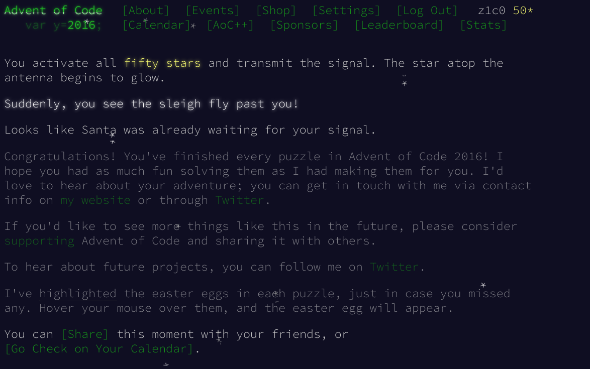
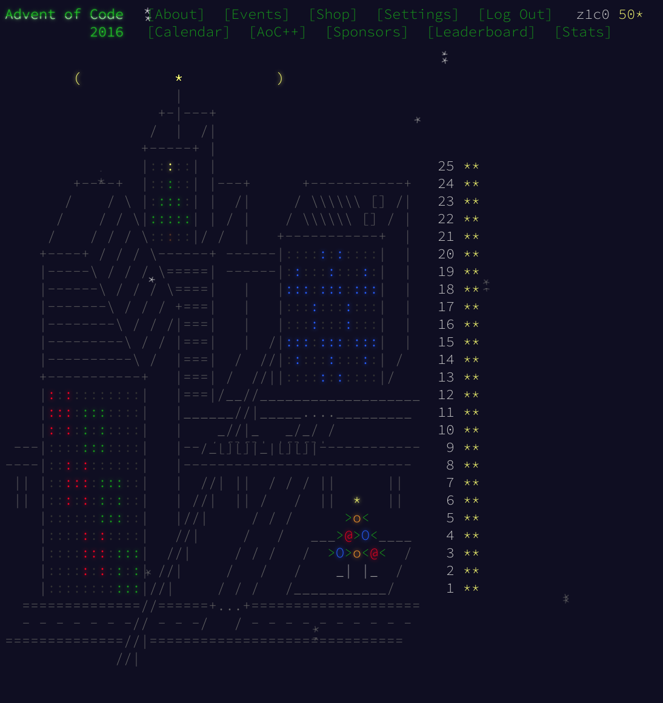

# Advent of Code 2016

https://adventofcode.com/2016

## Day11

This took me a while. Especially part 2 which took ... quite a while.

```txt
Finished after 55 steps!
27852.6190233 seconds
```

That's ... almost **8 hours**. Nothing to be proud of 😬.

I already knew from the first part that my solution was not great but I let it run
overnight because I was curious how long it actually would take to finish.

Changing my algorithm from a [DFS](https://en.wikipedia.org/wiki/Depth-first_search)
to a [BFS](https://en.wikipedia.org/wiki/Breadth-first_search) approach
brought the execution time down slightly.

What really brought execution time down was clever caching of the state (i.e. what
configuration had I already tried). Instead of encoding every microchip and generator
individually, I realized I could **treat them the same**. E.g. every microchip
on floor one with its generator on floor 3 is the same. Encoding the difference of
floors for each microchip with their generator brought time down to 15 seconds 🥳!

```txt
Finished after 55 steps!
END (after 15.2185878 seconds)
```

## Day 19

Part 2 was a real challenge.
The first approach using a `LinkedList` had worked fine for *Part 1* but showed
dismal performance now.

```txt
Elf 1407007 gets all (3001330) the presents.
END (after 26696.1142087 seconds)
```

Again, .. more than **7 hours** 😬.

The problem was the linear search for locating an element in the list that caused
an `O(n²)` complexity. My solution was a custom data structure I called
`BucketList` (haha) which maintains the elements in a list of lists that have the
same maximum size ("buckets"). This way I brought the runtime down dramatically,
because instead of linear I have mostly `O(1)` lookups to elements.

> Note: A bucket size of `25.000` worked best in my case but your mileage may vary, of course.

```txt
Elf 1407007 gets all (3001330) the presents.
END (after 17.0722168 seconds)
```

**17 seconds** ... way better 🤩.

## Day 22

```txt
...
Goal reached after 271 steps
Goal reached after 269 steps
Goal reached after 267 steps
Goal reached after 265 steps
Goal reached after 263 steps
Goal reached after 261 steps
END (after 3245.6201707 seconds)
```

54 minutes ... meh ... good enough.

## All Done!



